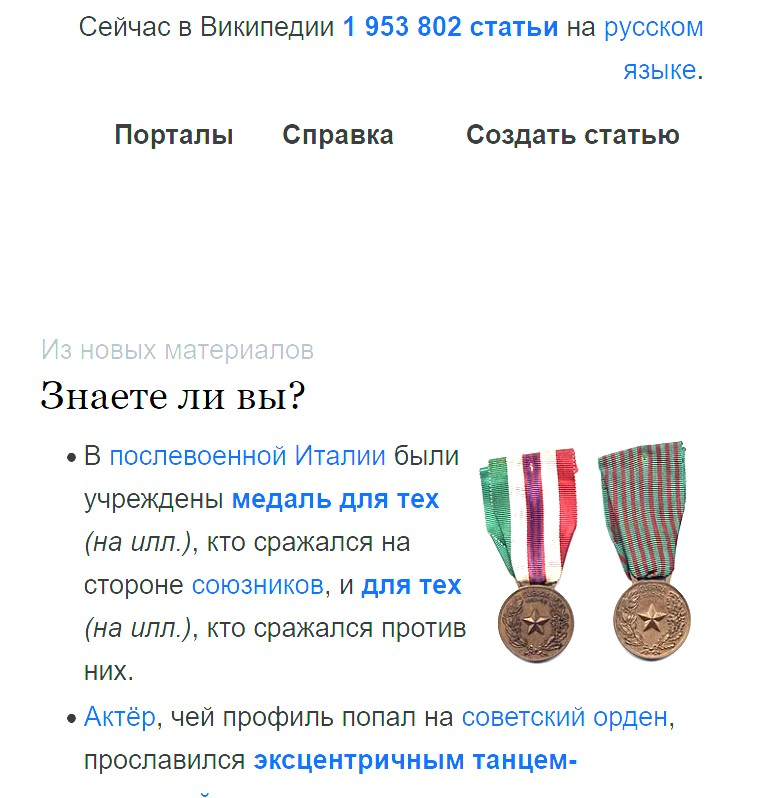
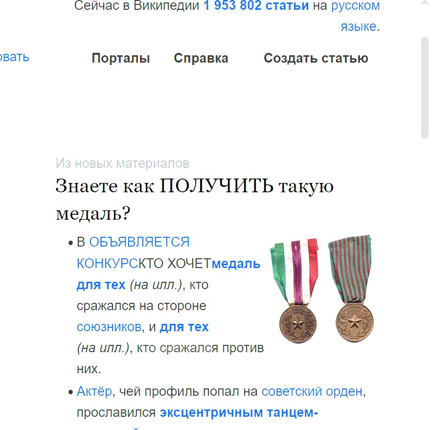
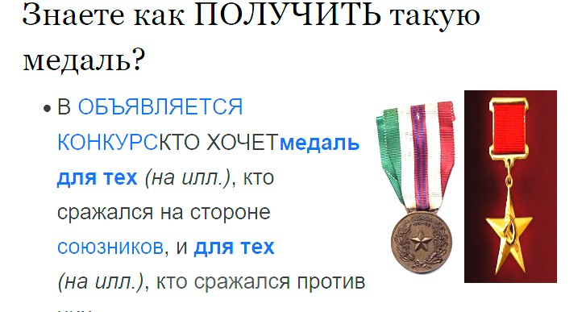

\\ 1. Определите, на каком протоколе работает сайт youtube.com. 
\\ Сделайте скриншот с названием 1_protocol.jpg, по которому станет 
\\ понятно, как вы определили протокол сайта.

В АДРЕСНОЙ СТРОКЕ МОЖНО УВИДЕТЬ, ЧТО САЙТ РАБОТАЕТ ПО ПРОТОКОЛУ HTTPS:

\\ 2. Создайте файл 2_analyze.txt, в котором проанализируйте структуру страницы сайта https://ru.wikipedia.org/,
\\ а именно нужно описать (коротко, своими словами), какие блоки есть на сайте, что в этих блоках находится.
\\ Есть ли на сайте шапка, подвал, что в них содержится? Как и где расположен контент?
\\ Есть ли дополнительные элементы на странице?

Воспользуемся инструментом средство разработчика (F12)? с помощью которого можно детально разглядеть структуру сайта.
На ВИКИ присутствет вся структура - шапка, контент и подвал. Контент располжен в центральной части сайта, 
левее контента адресная строка с заголовками по темам (активные ссылки). Это и есть дополнительные элементы, к 
которым так же можно отнести картинки и поисковую строку

// 3. Внесите не менее 10 изменений на страницу любой статьи сайта https://ru.wikipedia.org/, с помощью инструмента разработчика
// и представьте два скриншота было/стало (скриншоты должны иметь названия 3_before.jpg, //3_after.jpg соответственно). Желательно 
// поработать с изменением текста на странице, заменой картинки, изменением стилей.

// Для начала заменим текст на этом фрагменте:

на такой:

// Теперь поменяем картинку:

